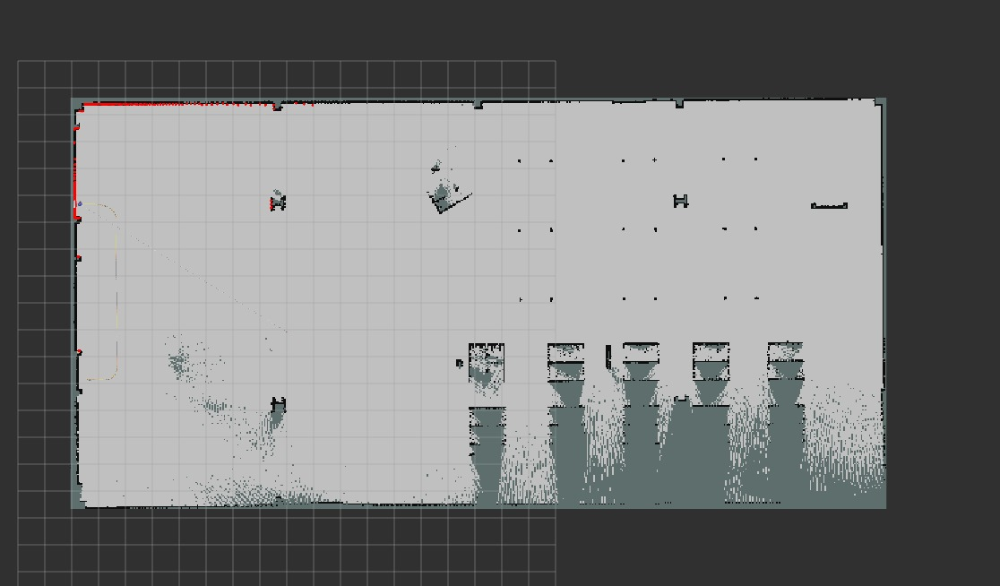

# Romi Autonomous Exploration & Mapping Pipeline

This workspace contains a production-ready ROS 2 (Humble) + Gazebo Ignition (Fortress) environment for the Romi differential drive robot. It leverages a fully autonomous exploration architecture based on reactive potential-field steering, coverage-based novelty guidance, a robust 2D SLAM pipeline, and a comprehensive 3D dataset recording system for structure-from-motion (SfM) pipelines.

##  Architecture Overview

The system is designed in a modular, distributed architecture across several ROS 2 nodes, communicating via DDS:

1. **Simulation Engine (`ros_gz_sim`)**: Gazebo Ignition Fortress simulates the environment (`tugbot_depot.sdf`), handling physics, collision intersections, and rendering.
2. **Robot Model (`romi_meshes.urdf`)**: A customized URDF representing Romi. The chassis dimensions are explicitly defined (0.16m width) to allow physics-aware navigation. 
3. **Sensor Plugins**:
   - **Custom Differential Drive C++ Plugin** (`romi_encoder_plugin.cpp`): Simulates wheel encoders and provides raw odometry (`/model/romi/odometry`).
   - **2D GPU LiDAR**: 360° scan array.
   - **RealSense RGB-D Camera**: Point clouds (`/depth_camera/points`), RGB images (`/depth_camera/image`), and Depth Maps (`/depth_camera/depth_image`).
   - **IMU**: High-frequency acceleration and angular velocity data.
4. **State Estimation (`robot_localization`)**: An Extended Kalman Filter (EKF) fuses raw wheel odometry with IMU data to produce a highly stable, drift-compensated transform (`/odometry/filtered`).
5. **Autonomy Engine (`autonomous_explorer.py`)**: The brain of the operation. Consumes LiDAR and Odometry to generate `/cmd_vel` vectors using a Hybrid Potential-Field algorithm.
6. **Data Recorder (`data_recorder.py`)**: A synchronous, non-blocking node that captures synchronized sensor outputs to disk, formatting them specifically for downstream 3D reconstruction (e.g., COLMAP, NeRF).
7. **Mapping (`slam_toolbox`)**: Asynchronous 2D SLAM node that builds an occupancy grid (`/map`) of the environment using the filtered odometry and LiDAR scans.

---

## System Schema & Data Flow

```text
[Gazebo Simulation]
       │
       ├─> (Raw Odom) ─────> [ EKF Node ] ─────> (Filtered Odom) ────┬────> [ autonomous_explorer.py ]
       ├─> (IMU) ──────────> (robot_localization)                    │                  │
       ├─> (2D LiDAR) ───────────────────────────────────────────────┤                  V
       │                                                             │             (Twist Cmd)
       ├─> (RGB Image) ────┐                                         │                  │
       ├─> (Depth Image) ──┼─────────────────────────────────────────┼──────> [ Gazebo /cmd_vel ]
       ├─> (Point Cloud) ──┘                                         │
       │                                                             │
       └─> [ data_recorder.py ] <────────────────────────────────────┘
                  │
                  V
     [ SSD Storage: data/romi_capture_YYYYMMDD_HHMMSS/ ]
```

---

## Algorithms & Autonomy Working Principles

The exploration engine relies on a fusion of classical robotics state estimation and a custom **Hybrid Potential Field + State Machine** architecture for navigation. 

### 1. Extended Kalman Filter (EKF)
Used for State Estimation via the `robot_localization` package. 
- Wheel encoders alone suffer from drift (slip over time). 
- The EKF algorithm mathematically fuses the raw wheel odometry with the high-frequency angular velocity from the IMU to output a highly stable, drift-compensated pose (`/odometry/filtered`).

### 2. 2D SLAM (Simultaneous Localization and Mapping)
Provided by the `slam_toolbox` package.
- It takes the EKF-filtered odometry and the 2D LiDAR scans and uses them to asynchronously build an occupancy grid (`/map`) of the environment while simultaneously tracking the robot's location within that emerging map.

### 3. Hybrid Potential-Field Steering (Reactive Navigation)
This is the primary algorithm driving the robot. Instead of plotting a rigid path, it uses the 2D LiDAR to create a "force field" around the robot:
- **Repulsive Forces**: The LiDAR field is divided into 7 sectors. Obstacles within an influence radius (`obstacle_threshold`) exert a repulsive force inversely proportional to distance ($\propto 1/d$).
- **Curvature Control**: These forces are summed together to create continuous, smooth steering vectors, allowing the robot to naturally "curve" around corners and obstacles without having to stop to turn.
- **Velocity Profiling**: Linear velocity is directly proportional to forward clearance. The robot sprints in open areas and crawls through narrow gaps.

### 4. Coverage Grid & Novelty-Biased Exploration
To ensure the robot doesn't just drive in circles in a safe area, we built a custom exploration algorithm based on **Spatial Hashing** and **Frontier Exploration**:
- **Discretization**: The world is divided into a spatial hash map of 0.5m grid cells. As the robot traverses, cells are marked as `visited`.
- **Lookahead Bias (Novelty Score)**: The robot projects a 4.0m ray into the left and right diagonal quadrants. It counts the number of *unvisited* cells along each ray. 
- **Attractive Force**: This novelty score is converted into an attractive force that applies a continuous rotational bias to the potential field, gently steering the robot toward unexplored territory without requiring hard state changes.

### 5. Kinematic Displacement Watchdog
A deterministic safety algorithm we wrote to detect "stuck" states:
- It tracks the robot's Cartesian displacement ($d = \sqrt{(x_2 - x_1)^2 + (y_2 - y_1)^2}$) over a rolling 5-second window. 
- If the robot moves less than 0.08m despite the motors being active, the algorithm concludes the robot is trapped and overrides the potential field with a decisive `SPINNING` or `REVERSING` escape sequence.

### 6. Kinematic Dimension & Gap-Width Checks
Romi is physically aware of its own dimensions:
- **Chassis Width**: 0.16m
- **Minimum Safe Passage**: Computed dynamically as chassis width plus a clearance margin (`MIN_PASSAGE = 0.30m`). 
The robot continuously sums the left and right lateral distances. If the total passage width is less than `0.30m`, the robot refuses entry, drastically reducing lateral collisions with thin poles and table legs.

---

## Challenges Faced & Solved

1. **The LiDAR "Blind Spot" Bug (Min Range Satiation)**
   - **Challenge:** The robot kept ramming into thin vertical poles. Logs showed the robot believed the path was `inf` (completely clear).
   - **Cause:** The LiDAR hardware configuration had a `min_range` of `0.12m`. When Romi's physical bumper (which extends `0.08m`) touched a pole, the pole was `0.08m` from the LiDAR sensor. Because `0.08m < 0.12m`, the LiDAR reported values below `min_range`. The code filtered these out as "invalid", resulting in an empty array, which mathematically resolved to `infinity` (clear path).
   - **Solution:** Modified the `_zone()` function. If even a *single ray* in a sector registers a value less than or equal to `scan.range_min`, the code overrides the distance to `0.05m` (contact distance), instantly triggering a violent REVERSING maneuver.

2. **Force-Cancellation Stalling**
   - **Challenge:** In perfect corners, the repulsive force from the front wall and side wall mathematically canceled out to a `0.0` steering vector, causing the robot to drive straight into the corner and get stuck.
   - **Solution:** Implemented a **Force Cancellation Deadzone**. If forward clearance is low but the net steering vector is near zero, the algorithm injects a synthetic `0.8 rad/s` rotation based on whichever side has slightly more clearance, forcing the robot out of equilibrium.

3. **Data Overwriting & File Desynchronization**
   - **Challenge:** Restarting the node via `Ctrl+C` caused the data recorder to overwrite the previous session's directory, destroying hours of 3D reconstruction data.
   - **Solution:** Rewrote `data_recorder.py` to use absolute workspace resolution and timestamped directories (`romi_capture_YYYYMMDD_HHMMSS`). A safety `while candidate.exists():` loop guarantees an index suffix (`_1`, `_2`) is appended if two sessions start in the exact same second.

---

## System Paths

- **Core Launch File:** `src/romi_gazebo/launch/romi_control.launch.py`
- **Gazebo World Definition:** `src/romi_gazebo/models/tugbot_depot.sdf`
- **Autonomy Engine:** `src/romi_gazebo/scripts/autonomous_explorer.py`
- **Data Pipeline:** `src/romi_gazebo/scripts/data_recorder.py`
- **EKF Configuration:** `src/romi_gazebo/config/ekf_params.yaml`
- **URDF / Robot Model:** `src/romi_gazebo/urdf/romi_meshes.urdf`

---

## Outputs & Dataset Format

All data is recorded cleanly into a session-specific folder within the workspace root.

**Example Output Path:**
`~/Documents/robotics/romi_project/romi_ws/data/romi_capture_20260608_185435/`

### Output Placeholder Schema

```text
romi_capture_YYYYMMDD_HHMMSS/
├── camera_info.json         # RealSense intrinsics (fx, fy, cx, cy, distortion)
├── images.txt               # COLMAP-ready extrinsic poses (ID QW QX QY QZ TX TY TZ 1 NAME)
├── ground_truth.csv         # Raw Gazebo World coordinates (X, Y, Z, QX, QY, QZ, QW)
├── imu.csv                  # 100Hz acceleration and gyroscope vectors
├── odometry.csv             # EKF-Filtered odometry
├── odometry_raw.csv         # Direct wheel-encoder odometry (for drift analysis)
├── trajectory.csv           # Cleaned X,Y,Z,Q path history
├── transforms.csv           # Sensor-to-Odom TF tree lookups (time-synced)
├── images/
│   ├── rgb/                 # Synchronized 8-bit JPEG RGB frames
│   │   ├── frame_000000.jpg
│   │   └── frame_000001.jpg
│   └── depth/               # Synchronized 16-bit PNG Depth maps (in millimetres)
│       ├── frame_000000.png
│       └── frame_000001.png
└── pointclouds/             # Binary Little-Endian PLY files (XYZ + RGB)
    ├── cloud_000000.ply
    └── cloud_000001.ply
```

*(Note: Point clouds are saved in binary little-endian format to reduce disk I/O latency, making them 5x smaller and 10x faster to write than ASCII PLYs. Depth maps are converted from Gazebo 32FC1 floats to 16UC1 millimetres, complying with standard Open3D and BundleFusion pipelines).*


